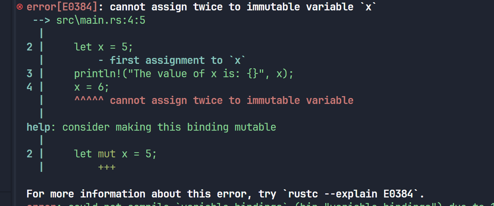
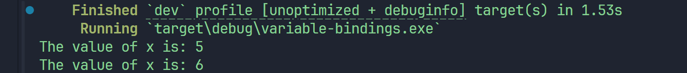
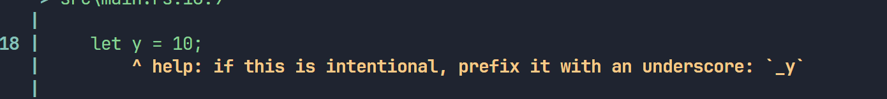
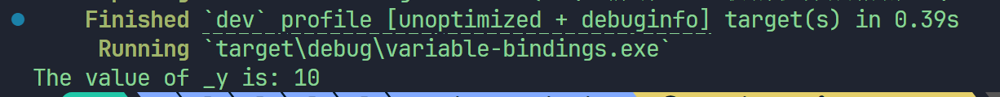
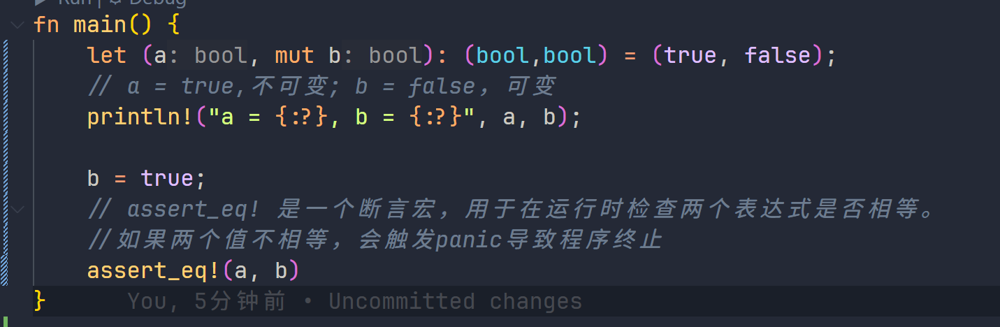

# Rust-note
Rust学习之旅

## 基础入门
### 1. 环境搭建
- 安装Rust ✅
- 安装VSCode ✅
- 安装Rust插件 ✅
- 安装Rust代码格式化插件 ✅
- 安装Rust代码片段插件  ✅

### 2. 基础语法
#### 代码片段 🌜
 -- 先通过一段代码来简单浏览下 Rust 的语法：
```rust
// Rust 程序入口函数，跟其它语言一样，都是 main，该函数目前无返回值
fn main() {
    // 使用let来声明变量，进行绑定，a是不可变的
    // 此处没有指定a的类型，编译器会默认根据a的值为a推断类型：i32，有符号32位整数
    // 语句的末尾必须以分号结尾
    let a = 10;
    // 主动指定b的类型为i32
    let b: i32 = 20;
    // 这里有两点值得注意：
    // 1. 可以在数值中带上类型:30i32表示数值是30，类型是i32
    // 2. c是可变的，mut是mutable的缩写
    let mut c = 30i32;
    // 还能在数值和类型中间添加一个下划线，让可读性更好
    let d = 30_i32;
    // 跟其它语言一样，可以使用一个函数的返回值来作为另一个函数的参数
    let e = add(add(a, b), add(c, d));

    // println!是宏调用，看起来像是函数但是它返回的是宏定义的代码块
    // 该函数将指定的格式化字符串输出到标准输出中(控制台)
    // {}是占位符，在具体执行过程中，会把e的值代入进来
    println!("( a + b ) + ( c + d ) = {}", e);
}

// 定义一个函数，输入两个i32类型的32位有符号整数，返回它们的和
fn add(i: i32, j: i32) -> i32 {
    // 返回相加值，这里可以省略return
    i + j
}
```
#### 注意事项 ⚠️
注意 在上面的 add 函数中，不要为 i+j 添加 ;，这会改变语法导致函数返回 () 而不是 i32，具体参见语句和表达式。
有几点可以留意下：

字符串使用双引号 "" 而不是单引号 ''，Rust 中单引号是留给单个字符类型（char）使用的
Rust 使用 {} 来作为格式化输出占位符，其它语言可能使用的是 %s，%d，%p 等，由于 println! 会自动推导出具体的类型，因此无需手动指定


### 3、Rust 基础

#### 3.1 变量绑定与解构
 ##### 3.1.1 变量绑定
```rust
fn main() {
    let x = 5;
    println!("The value of x is: {}", x);
    x = 6;
    println!("The value of x is: {}", x);
}
```
保存文件，再使用 cargo run 运行它，迎面而来的是一条错误提示 ❎


具体的错误原因是 cannot assign twice to immutable variable x（无法对不可变的变量进行重复赋值），因为我们想为不可变的 x 变量再次赋值。

为了让变量声明为可变（**使用mut关键字**）,将 src/main.rs 改为以下内容：👁️

```rust
fn main() {
    let mut x = 5;
    println!("The value of x is: {}", x);
    x = 6;
    println!("The value of x is: {}", x);
}
```

运行一下：


**总结**
选择可变还是不可变，更多的还是取决于你的使用场景，例如不可变可以带来安全性，但是丧失了灵活性和性能（如果你要改变，就要重新创建一个新的变量，这里涉及到内存对象的再分配）。而可变变量最大的好处就是使用上的灵活性和性能上的提升。

如果你创建了一个变量却不在任何地方使用它，Rust 通常会给你一个警告，因为这可能会是个 BUG。但是有时创建一个不会被使用的变量是有用的，比如你正在设计原型或刚刚开始一个项目。这时你希望告诉 Rust 不要警告未使用的变量，为此可以用下划线作为变量名的开头：
```rust
fn main() {
    let _x = 5;
    let y = 10;
}
```


可以看到，两个变量都是只有声明，没有使用，但是编译器却独独给出了 y 未被使用的警告，充分说明了 _ 变量名前缀在这里发挥的作用。
我们把y修改为_y，再运行一下：


可以看到，编译器已经不再给出任何警告了。
##### 3.1.2 变量解构
let 表达式不仅仅用于变量的绑定，还能进行复杂变量的解构：从一个相对复杂的变量中，匹配出该变量的一部分内容：



##### 3.1.3 变量遮蔽
```rust
fn main() {
    let x = 5;
    // 在main函数的作用域内对之前的x进行遮蔽
    let x = x + 1;

    {
        // 在当前的花括号作用域内，对之前的x进行遮蔽
        let x = x * 2;
        println!("The value of x in the inner scope is: {}", x);
    }

    println!("The value of x is: {}", x);
}
```
这个程序首先将数值 5 绑定到 x，然后通过重复使用 let x = 来遮蔽之前的 x，并取原来的值加上 1，所以 x 的值变成了 6。第三个 let 语句同样遮蔽前面的 x，取之前的值并乘上 2，得到的 x 最终值为 12。当运行此程序，将输出以下内容：


这和 **mut** 变量的使用是不同的，第二个 let 生成了完全不同的新变量，两个变量只是恰好拥有同样的名称，涉及一次内存对象的再分配 ，而 **mut** 声明的变量，可以修改同一个内存地址上的值，并不会发生内存对象的再分配，性能要更好。

变量遮蔽的用处在于，如果你在某个作用域内无需再使用之前的变量（在被遮蔽后，无法再访问到之前的同名变量），就可以重复的使用变量名字，而不用绞尽脑汁去想更多的名字。

